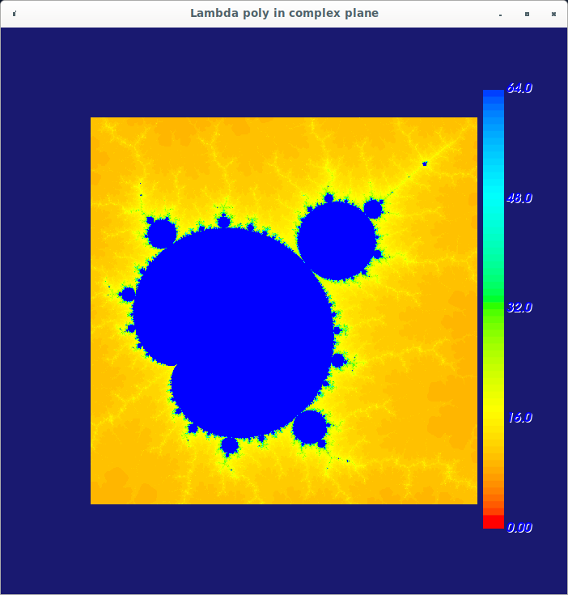
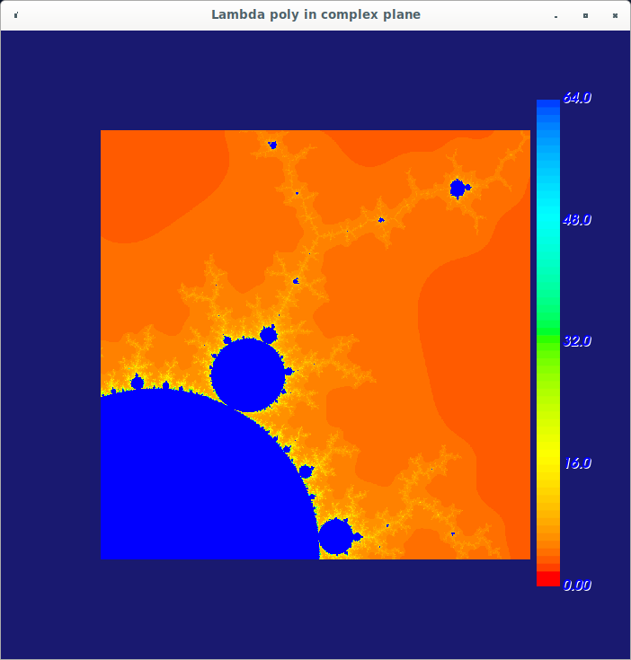
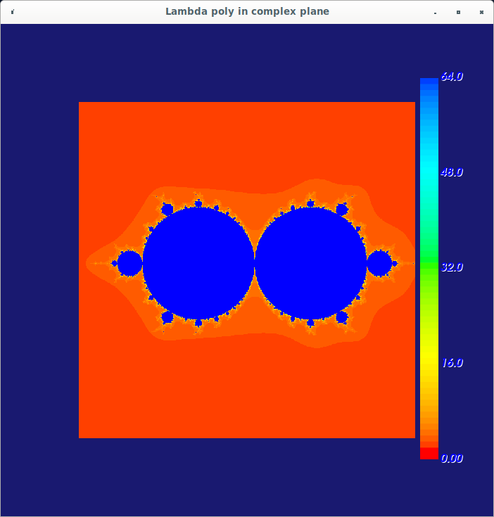
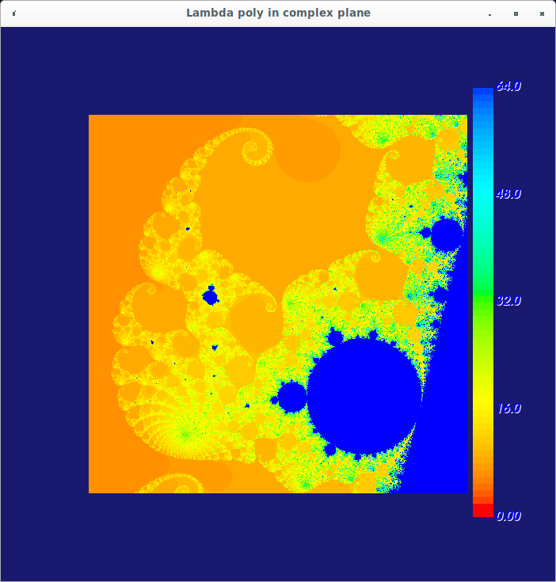

This is a Mandelbrot set explorer written in CUDA and using VTK for
graphics and mouse interactions.  The code is targeted to run on my
"personal supercomputer", which is a Dell Precision 7810 tower with an
Nvidia Tesla K80 GPGPU as the compute engine.

This Mandelbrot explorer iterates the logistic map,
$$
x_{n+1} = \lambda x_n (1 - x_n)
$$
instead of the usual Mandelbrot map
$$
z_{n+1} = z_n^2 + C
$$
My explorer shows the escape time vs the parameter $\lambda$ in the
complex plane.  Some screenshots are below.

--------------------------------------------------------------
To run the explorer, just type "Mandelbrot" at the command line.  The
following command line args are optional:

-N Number of iterations to use.  Default is 8, but higher numbers (in
 the thousands) produce better Mandelbrot sets.

These are useful if you want to start the program displaying a
particular area in the complex plane:

-x Starting x    
-y Starting y    
-w Starting width to display    
-h Starting height to display    

--------------------------------------------------------------
To build the program from scratch:
mkdir build    
cd build    
cmake ..    
make    
./Mandelbrot    

Stuart Brorson, July 2022.

